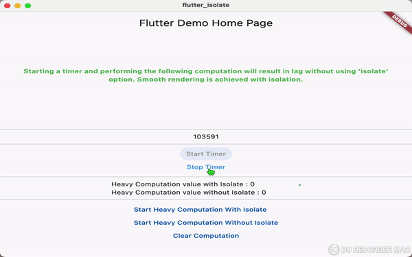

**Flutter Isolate**

This Flutter application demonstrates the performance difference between performing heavy computations on the main UI thread and offloading them to a separate isolate.

**For a deeper understanding of isolates and their use cases in Flutter, refer to this article:**

Concurrency and Isolates in Flutter and Dart by me (https://nimafarzin-pr.medium.com/concurrency-and-isolates-in-flutter-and-dart-81d6a36932e8)

**Features:**

- Starts a timer that updates every millisecond, simulating background activity.
- Performs heavy calculations (summation) with and without isolates.
- Displays the results of the heavy calculations, highlighting the isolate's benefit for smooth rendering.
- Provides buttons to:
  - Start the timer
  - Stop the timer
  - Run heavy computation with isolate
  - Run heavy computation without isolate
  - Clear computation results

**Understanding the Code:**

- `runHeavyTaskIWithIsolate` uses an isolate to perform the heavy computation and returns the result.
- `useIsolate` is the entry point for the isolate, receiving the data and sending the result back to the main thread.
- `runHeavyTaskWithOutIsolate` performs the heavy computation on the main UI thread.

**Running the App:**

1. Clone or download the repository containing the code.
2. Ensure you have Flutter installed ([https://flutter.dev/docs/get-started/install](https://flutter.dev/docs/get-started/install)).
3. Navigate to the project directory in your terminal.
4. Run `flutter run` to start the app on a connected device or emulator.

**Expected Behavior:**

- When the timer is running, you should see smooth updates without lag.
- Running heavy computations without isolates might cause UI stuttering during the calculation and circle loading.
- Heavy computations with isolates should complete without affecting the timer and circle Loading smooth updates.

**Benefits of Isolates:**

- Isolates prevent heavy computations from blocking the main UI thread, ensuring a responsive and smooth user experience.
- They create a separate memory space for the computation, potentially improving memory management.

**Additional Notes:**

- The specific performance improvement can vary depending on the complexity of your UI and the nature of the heavy computation.
- Consider using isolates when your app performs long-running tasks that could hinder UI responsiveness.

**Feel free to modify the code to experiment with different heavy computations and isolate usage.**
